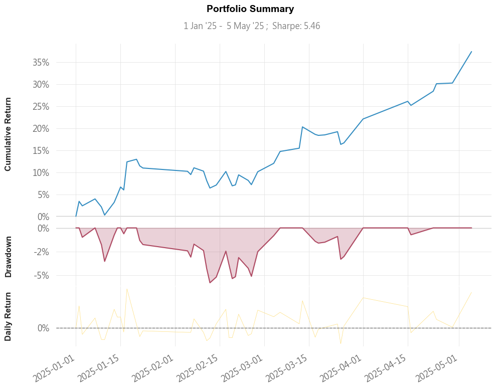
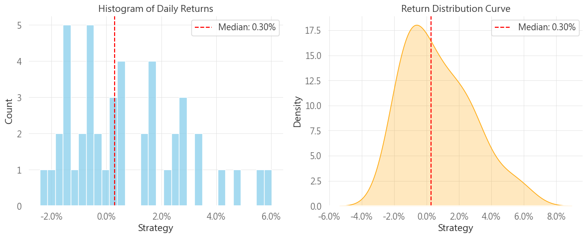
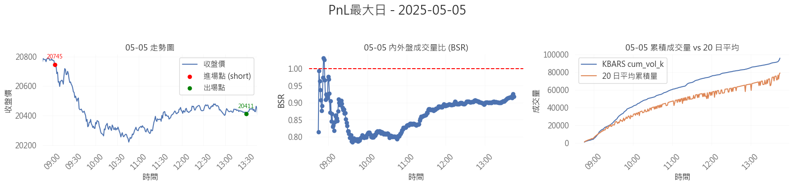
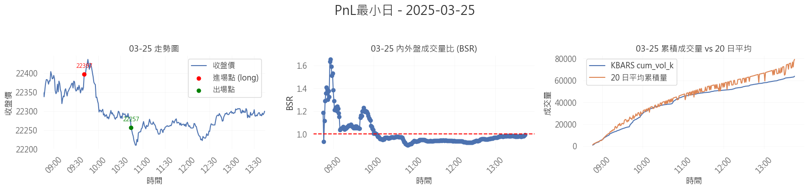

#  TAIEX Futures Backtesting Project 台指期策略回測專案

本專案展示一個以 **台指期 (TXF)** 為標的的量化策略回測流程，涵蓋了資料蒐集、參數優化與績效評估，使用 Python 與 Jupyter Notebook 撰寫，並搭配 [Shioaji API by 永豐金證券](https://sinotrade.github.io/) 取得即時與歷史資料。

---

## 專案內容

| Notebook 名稱 | 功能說明 |
|---------------|----------|
| `Backtesting_Data_collection.ipynb` | 抓取台指期 KBARS / TICKS 資料，處理每日交易資訊與前十大權值股走勢分析 |
| `Backtesting_Gridsearch.ipynb` | 對停利 / 停損參數進行 Grid Search，找出 Sharpe 與 PnL 最佳化區間 |
| `Backtesting_Result.ipynb` | 整合回測結果，輸出每筆交易紀錄、總績效統計與勝率、報酬風險比等指標 |

---

## 策略邏輯

- **進場條件：**
  - 台積電紅K、前十大權值股紅K 數量過半
  - 內外盤成交量比（BSR）超過閾值

- **出場條件：**
  - 達 TP 或 SL（依累積成交量比設定不同點數）
  - 或至收盤強制平倉

- **停利停損邏輯：**
  - 累積成交量比高 → 大偏移 TP/SL；反之則保守
  - 提升順勢操作的風險報酬比

---

## 總體績效摘要 Performance Summary

- 回測區間：**2025-01-02 ~ 2025-05-05**
- 年化報酬（CAGR）：**91.8%**
- 累積報酬：**+37.42%**
- Sharpe Ratio：**5.53**
- Max Drawdown：**-5.79%**
- Time in Market：**100%（無空窗）**



---

## 報酬分布分析 Return Distribution

- 左圖：每日報酬直方圖  
- 右圖：報酬密度估計（偏態右移）



---

## 單日最大獲利分析 - 2025-05-05

- 進場邏輯為偏空（BSR < 1）
- 成交量持續強勢，累積報酬明顯擴張



---

## 單日最大虧損分析 - 2025-03-25

- 當日雖符合偏多條件，但走勢快速反轉
- 提醒需加入成交量轉折與止損更精準判斷



---

## 詳細績效報表（摘要）

| 指標項目           | 數值        |
|--------------------|-------------|
| Start Period        | 2025-01-02  |
| End Period          | 2025-05-05  |
| Cumulative Return   | 37.42%      |
| CAGR                | 91.8%       |
| Sharpe              | 5.53        |
| Sortino             | 13.67       |
| Max Drawdown        | -5.79%      |
| Payoff Ratio        | 1.81        |
| Profit Factor       | 2.47        |
| Outlier Win Ratio   | 2.73        |
| Time in Market      | 100.0%      |
| Recovery Factor     | 5.68        |
| Ulcer Index         | 0.03        |
| Serenity Index      | 5.59        |

---

## 技術環境 Environment

- Python 3.9+
- 套件需求：
  ```bash
  pip install pandas polars numpy matplotlib shioaji

---

## 作者 Author

莊宗瀚 (Tsung Han Chuang)  
[GitHub](https://github.com/CTHQuant) ｜ [LinkedIn](https://linkedin.com/in/宗瀚-莊-1a8588358/)

---

## License

此專案為個人學習與展示用途，不構成任何投資建議。
